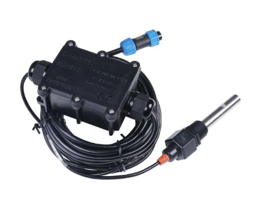

# ECTDS10_Modbus

An Arduino library to interface with the **Chinese ECTDS10 EC/TDS/Salinity/Temperature sensor** over **RS485 Modbus RTU**.

## Sensor Image

## Description

This library allows easy communication with the ECTDS10 sensor via RS485 using Modbus RTU protocol. It provides access to key measurements such as:

- Temperature (°C)
- Electrical Conductivity (μS/cm)
- Salinity (ppm)
- Total Dissolved Solids (TDS, ppm)

## Features

- Simple Modbus RTU communication over RS485
- Supports SoftwareSerial and HardwareSerial
- Returns values as float (temperature) and uint16_t (EC, Salinity, TDS)
- Easy-to-use interface

## Hardware Requirements

- ECTDS10 sensor (RS485 Modbus RTU version)
- RS485 to TTL converter (e.g., MAX485)
- Arduino board (Uno, Mega, ESP32, etc.)

## Installation

1. Download or clone this repository.
2. Place the `ECTDS10_Modbus` folder inside your Arduino `libraries` folder.
3. Restart your Arduino IDE.

## Notes

- The default Modbus slave address for most Chinese ECTDS10 sensors is `0x01`.
- Communication baud rate is typically `9600`.
- Make sure your RS485 module is connected properly (DI/RO/DE/RE lines).
